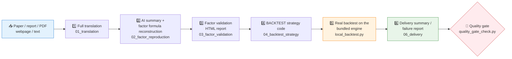

# 🔬 Quant Research Replication

[简体中文](README.md) | **English**

> Discovers or accepts quantitative papers, research reports, PDFs, webpages, or text sources, and turns them into a complete research replication package: full translation → factor formula reconstruction → effectiveness validation → strategy code → real local backtest → delivery summary.

<p align="center">
  
  
  
  
  
  
</p>

---

## 📖 What is this

`quant-research-replication` is a self-contained **Codex/Agent skill** for discovering or accepting quantitative finance papers, research reports, PDFs, webpages, or text sources, then turning them into a complete research replication package.

The default output root is:

```text
/home/coder/project/replication/quant-research-replication
```

## ⚡ Replication Pipeline



## 🚧 Boundaries

This skill should **not call other research or data skills** during these stages:

- Report or paper translation.
- Factor formula reconstruction.
- Factor validation.
- Data preparation.
- BACKTEST strategy generation.
- BACKTEST execution.

## 🗃️ Data Rules

Data must be **real and traceable**. Prefer data required by the source report, user-provided data, data bound to the BACKTEST configuration, or data sources explicitly recorded in the current project.

> 🚫 Do not use synthetic data, simulated market data, or random market data to prove factor effectiveness. Random factors with a fixed seed may only be used as negative controls against the same real return data.

## 📦 Output Layout

```text
/home/coder/project/replication/quant-research-replication/{report_id}/
  01_translation/
    full_translation.md                 # full translation
  02_factor_reproduction/
    ai_summary_and_factor_formula.md    # AI summary & factor formula
    reference_implementation.py         # reference implementation
  03_factor_validation/
    factor_validation_report.html       # factor validation HTML report
    data/
      benchmark_comparison.csv
      backtest_alignment_audit.csv
    charts/
  04_backtest_strategy/
    strategy.py                         # BACKTEST strategy
    config.json
    backtest_report.html                # backtest report
    backtest_report_raw.html
    backtest_logs/
      signal_log.jsonl
      equity_curve.csv
      performance_metrics.csv
      trades.csv
      position_return_detail.csv
  06_delivery/
    final_delivery_summary.md           # final delivery summary
  failure_report.md                     # failure report when blocked
  manifest.json
```

## 🧪 Factor Validation Requirements

The factor validation report should include:

| Dimension | Content |
|---|---|
| 📊 Data quality | Data coverage, missing values, outliers, factor distribution |
| 📈 IC family | IC, Rank IC, ICIR, annual IC, rolling IC |
| 💰 Portfolio performance | Quantile portfolio returns, long-short returns, cumulative net value, drawdown |
| 📐 Performance metrics | Annual return, annual volatility, Sharpe, Calmar, max drawdown, win rate, turnover |
| 🔀 Sample validation | IS/OOS/Walk-forward validation (or an explanation when data is insufficient) |
| 🛡️ Robustness | Parameter stability, transaction-cost sensitivity, reverse factor, random factor, simple benchmark comparison |
| 🔍 Factor audit | Data availability, signal lag, label construction, execution price, look-ahead checks, price-leakage checks, sample split, cost assumptions |
| 🧮 Alignment audit | Theoretical factor-validation curve vs the actual BACKTEST equity curve |

## 🧰 Helper Scripts

| Script | Purpose |
|---|---|
| `scripts/check_dependencies.py --install` | Check and auto-install Python dependencies (or `pip install -r requirements.txt`) |
| `scripts/create_project.py` | Create the standard output directory and `manifest.json` |
| `scripts/local_backtest.py {report_dir} --market-data xxx.csv` | Bundled local backtest engine; market data may be CSV/Parquet with `date`, `symbol`, `close` columns by default |
| `scripts/check_step5_strategy.py` | Check strategy, config, backtest report, signal log, equity curve, performance, and trades |
| `scripts/build_factor_report.py` | Build a standalone HTML factor-validation report skeleton from structured JSON metrics |
| `scripts/quality_gate_check.py` | Pre-delivery quality gate: RAG scorecard, benchmark comparison, alignment audit, per-chart explanations, log completeness, placeholder cleanup |

The backtest engine reads the signal log from `04_backtest_strategy/backtest_logs/signal_log.jsonl` by default.

## 📚 Key References

```text
references/output_contract.md               # output contract
references/factor_validation_checklist.md   # factor validation checklist
references/factor_audit_and_robustness.md   # factor audit & robustness
references/backtest_engine.md               # backtest engine notes
references/data_sources.md                  # data source conventions
references/source_discovery.md              # source discovery & search
```

## ✅ Acceptance Criteria

Each research replication should verify:

1. The complete output structure was generated.
2. Real, traceable data was used.
3. Factor audit and robustness checks were completed.
4. BACKTEST strategy code was generated.
5. The bundled BACKTEST or a user-provided external BACKTEST actually ran, or a blocking reason was recorded.
6. A BACKTEST HTML report or failure logs were saved.
7. A final delivery summary or failure report was generated.

## 📜 License

This project is licensed under the GNU General Public License v3.0. See [LICENSE](LICENSE).
