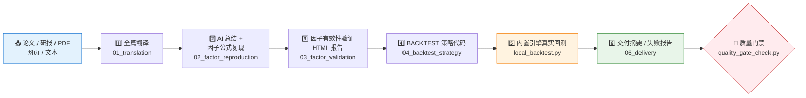

# 🔬 Quant Research Replication

**简体中文** | [English](README.en.md)

> 搜索或接收量化论文、研报、PDF、网页、文本材料，产出一套完整的研究复现交付包：全文翻译 → 因子公式复现 → 有效性验证 → 策略代码 → 真实本地回测 → 交付摘要。

<p align="center">
  
  
  
  
  
  
</p>


---

## 📖 Skill 定位

`quant-research-replication` 是一个自包含的 **Codex/Agent 技能包**：用于搜索或接收量化论文、研报、PDF、网页或文本材料，并转化为完整的研究复现交付包。

默认产出根目录：

```text
/home/coder/project/replication/quant-research-replication
```

## ⚡ 复现流水线



## 🚧 调用边界

该 Skill 在以下阶段**不调用其他研究/数据 Skills**：

- 研报翻译
- 因子公式复现
- 因子验证
- 数据准备
- BACKTEST 策略生成
- BACKTEST 回测

## 🗃️ 数据源原则

数据必须是**真实、可追溯**的数据。优先使用研报所需数据、用户提供数据、BACKTEST 配置所绑定的数据源，或当前项目明确记录的数据源。

> 🚫 禁止用合成数据、模拟行情、随机市场数据证明因子有效性。固定随机种子随机因子只能作为负控制基准，且必须建立在同一份真实收益数据上。

## 📦 标准产出结构

```text
/home/coder/project/replication/quant-research-replication/{report_id}/
  01_translation/
    full_translation.md                 # 全文翻译
  02_factor_reproduction/
    ai_summary_and_factor_formula.md    # AI 总结与因子公式
    reference_implementation.py         # 参考实现
  03_factor_validation/
    factor_validation_report.html       # 因子验证 HTML 报告
    data/
      benchmark_comparison.csv
      backtest_alignment_audit.csv
    charts/
  04_backtest_strategy/
    strategy.py                         # BACKTEST 策略
    config.json
    backtest_report.html                # 回测说明报告
    backtest_report_raw.html
    backtest_logs/
      signal_log.jsonl
      equity_curve.csv
      performance_metrics.csv
      trades.csv
      position_return_detail.csv
  06_delivery/
    final_delivery_summary.md           # 最终交付摘要
  failure_report.md                     # 失败时的报告
  manifest.json
```

## 🧪 因子验证要求

因子检验报告必须包含：

| 维度 | 内容 |
|---|---|
| 📊 数据质量 | 数据覆盖率、缺失率、异常值、因子分布 |
| 📈 IC 体系 | IC、Rank IC、ICIR、年度 IC、滚动 IC |
| 💰 组合表现 | 分层组合收益、多空组合收益、累计净值、回撤 |
| 📐 绩效指标 | 年化收益、年化波动、Sharpe、Calmar、最大回撤、胜率、换手率 |
| 🔀 样本检验 | IS/OOS/Walk-forward 验证（数据不足必须说明） |
| 🛡️ 稳健性 | 参数稳定性、交易成本敏感性、反向因子、随机因子、简单基准对照 |
| 🔍 因子审计 | 数据可得性、信号滞后、标签构造、成交价、未来函数检查、偷价格检查、样本拆分、成本假设 |
| 🧮 对齐审计 | 理论因子验证曲线 vs BACKTEST 实际权益曲线的口径差异 |

图表图片内部文字必须使用英文 ASCII；中文解读放在 HTML 图表说明中，避免 PNG 在缺少中文字体的环境里出现方块或乱码。

## 🧰 辅助脚本

| 脚本 | 用途 |
|---|---|
| `scripts/check_dependencies.py --install` | 检查并自动安装 Python 依赖（也可 `pip install -r requirements.txt`） |
| `scripts/create_project.py` | 创建标准输出目录和 `manifest.json` |
| `scripts/local_backtest.py {report_dir} --market-data xxx.csv` | 内置本地回测引擎；行情支持 CSV/Parquet，默认需要 `date`、`symbol`、`close` 列 |
| `scripts/check_step5_strategy.py` | 检查策略、配置、回测报告、信号日志、权益曲线、绩效与交易记录 |
| `scripts/build_factor_report.py` | 根据结构化 JSON 指标生成 HTML 因子检验报告骨架 |
| `scripts/quality_gate_check.py` | 交付前质量门禁：RAG scorecard、基准对照、对齐审计、每图解释、日志完整性、占位内容清理 |

回测引擎默认读取信号日志：`04_backtest_strategy/backtest_logs/signal_log.jsonl`。

## 📚 关键参考文件

```text
references/output_contract.md               # 产出契约
references/factor_validation_checklist.md   # 因子验证清单
references/factor_audit_and_robustness.md   # 因子审计与稳健性
references/backtest_engine.md               # 回测引擎说明
references/data_sources.md                  # 数据源约定
references/source_discovery.md              # 材料发现与搜索
```

## ✅ 验收标准

每次研报复现都应检查：

1. 是否生成完整产出结构。
2. 是否使用真实、可追溯的数据。
3. 是否完成因子审计和稳健性检验。
4. 是否生成 BACKTEST 策略。
5. 是否实际运行内置 BACKTEST 或用户提供的外部 BACKTEST，或明确记录阻塞原因。
6. 是否保存 BACKTEST HTML 回测报告或失败日志。
7. 是否生成最终交付摘要或失败报告。

## 📜 许可证

本项目使用 GNU General Public License v3.0。详见 [LICENSE](LICENSE)。

## 🐼 PandaAI / QUANTSKILLS 社群

<div align="center">
  
  <br>
  <sub>扫码加入 PandaAI 社群，交流 QUANTSKILLS 技能、Agent 工作流与量化研究实践。</sub>
</div>
